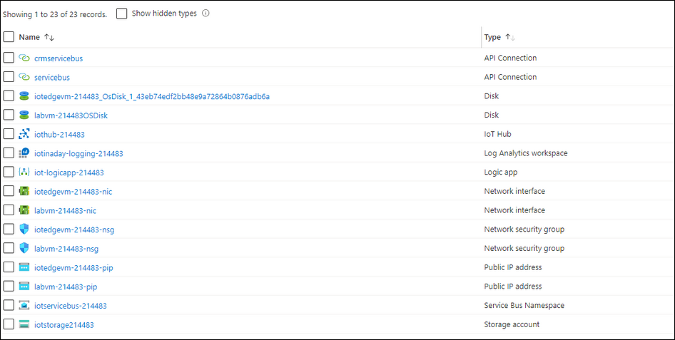
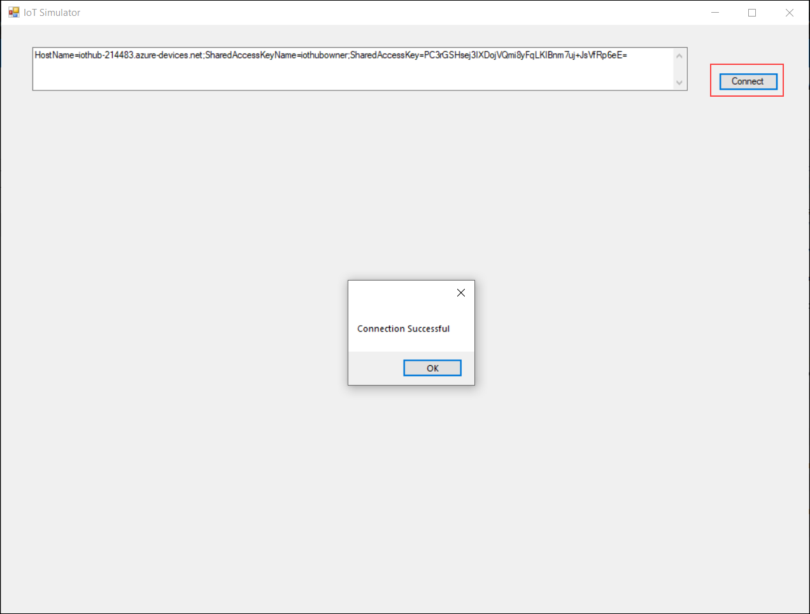
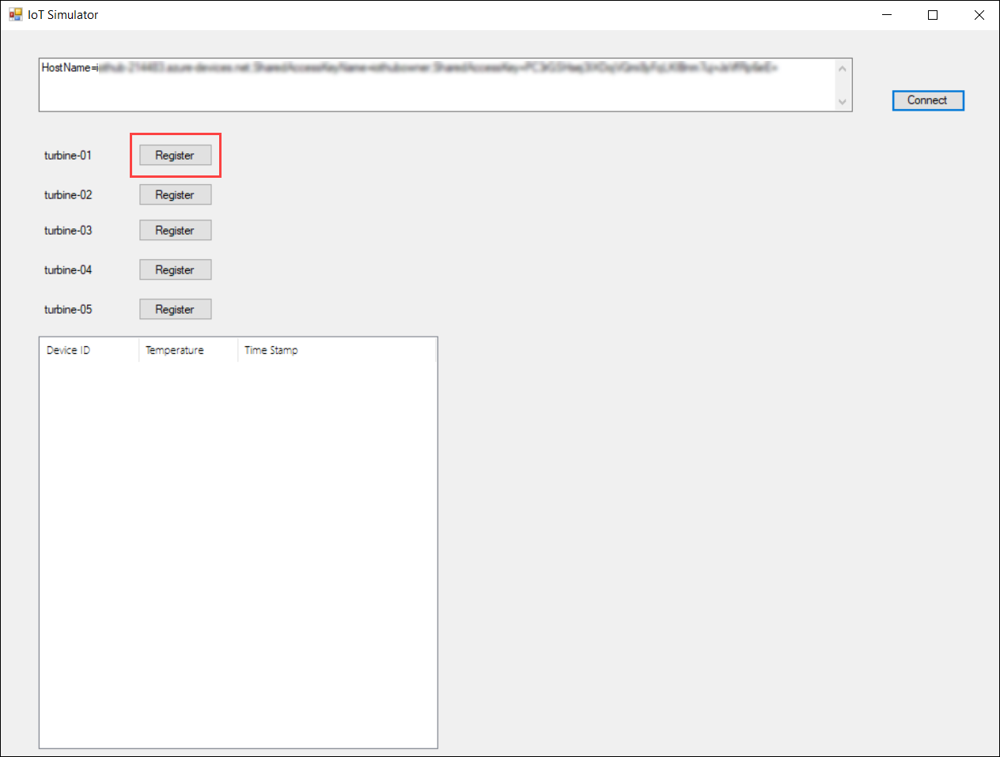
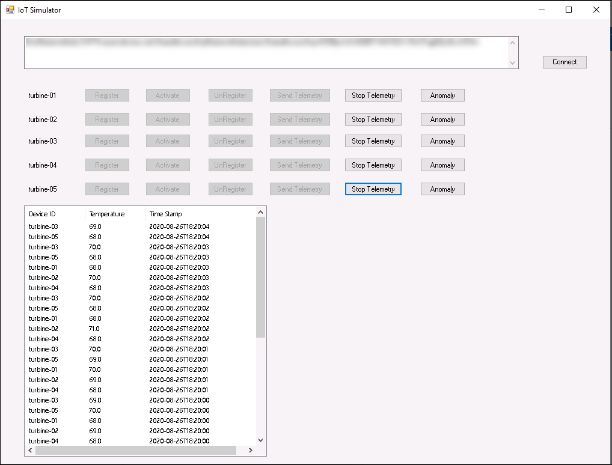
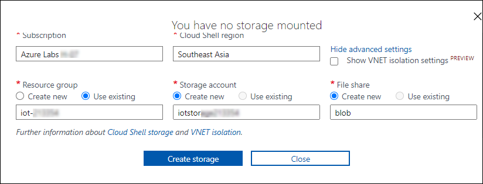

# Exercise 1: Getting Started with Azure IoT Services

## Scenario

*Turbine (devices)* are deployed across the globe. You need to configure the solution to receive telemetry and manage all the devices centrally in a reliable/scalable fashion.

## Overview

In this exercise, you will connect devices deployed across the globe to Azure IoT Hub and manage all the devices centrally in a reliable/scalable fashion and, configure the solution to receive telemetry.

This exercise includes the following tasks:

* Login to Azure Portal and verify the existing/pre-deployed resources
* Explore the IoT Hub service
* Connect device (simulated) to Azure IoT Hub
* Verify telemetry stream from Azure IoT Hub

## Instructions

### Getting Started with Lab

1. Once the environment is provisioned, a virtual machine (JumpVM) on the left and lab guide on the right will get loaded in your browser. Use this virtual machine throughout the workshop to perform the lab.

1. To get the lab environment details, you can select the **Lab Environment** tab on the right. Additionally, the credentials will also be emailed to your email address provided during registration.

   

 > You will see Suffix/DeploymentID value on **Lab Environment** tab, use it wherever you see SUFFIX or DeploymentID in lab steps.
 
#### Task 1: Log in to Azure Portal and verify the existing/pre-deployed resources

1. In the JumpVM, click on the Azure portal shortcut of the Microsoft Edge browser which is created on the desktop.

     

1. On **Sign in to Microsoft Azure** blade, you will see a login screen, in that enter following email/username and then click on **Next**. 
   * Email/Username: <inject key="AzureAdUserEmail"></inject>

1. Now enter the following password and click on **Sign in**.
   * Password: <inject key="AzureAdUserPassword"></inject>

1. If you see the pop-up **Stay Signed in?**, click No

1. If you see the pop-up **You have free Azure Advisor recommendations!**, close the window to continue the lab.

1. If a **Welcome to Microsoft Azure** popup window appears, click **Maybe Later** to skip the tour.
   
1. In the upper left corner of the portal window, to open the Azure portal menu, click the hamburger menu icon.
 
1. On the Azure portal menu, click **Resource groups**

    This blade displays all of the resource groups that you have access to the Azure subscription.

1. From the list, select **iot-{deployment-id}** and explore through the pre-created resources that are available in the resource group.

     

#### Task 2: Explore the IoT Hub service

**Azure IoT Hub** - IoT Hub is a managed service, hosted in the cloud, that acts as a central message hub for bi-directional communication between your IoT application and the devices it manages. You can use Azure IoT Hub to build IoT solutions with reliable and secure communications between millions of IoT devices and a cloud-hosted solution backend. You can connect virtually any device to IoT Hub.

1. In the resource group, select the existing IoT Hub named **iothub-{deployment-id}**.

1. On the left-side menu, under **Explorers**, click **IoT devices**

    This pane can be used to add, modify, and delete devices registered to your hub. You will get pretty familiar with this pane by the end of this lab.

1. On the left-side menu, near the top, click **Activity log** to view logs that can be used to review activities and diagnose issues. You can also define queries that help with routine tasks.

1. On the left-side menu, under **Settings**, click **Built-in endpoints**

    IoT Hub exposes "endpoints" that enable external connections. Essentially, an endpoint is anything connected to or communicating with your IoT Hub. You should see that your hub already has two endpoints defined:

    * _Events_
    * _Cloud to device messaging_

1. On the left-side menu, under **Messaging**, click **Message routing**

    The IoT Hub message routing feature enables you to route incoming device-to-cloud messages to service endpoints such as Azure Storage containers, Event Hubs, and Service Bus queues. You can also create routing rules to perform query-based routes.

1. At the top of the **Message routing** pane, click **Custom endpoints**.

    Custom endpoints (such as Service Bus queue and Storage) are often used within an IoT implementation.

1. Take a minute to scan through the menu options under **Settings**

    > **Note**:  This task is only intended to be an introduction to the IoT Hub service and get you more comfortable with the UI.
    
#### Task 3: Connect Turbine device (simulated) to Azure IoT Hub

In this task, you will connect the Turbine Devices to Azure IoT Hub.

1. From the **Environment Details** Tab on the right, copy the value of **IotHubConnectionString**. This connection string will be used in the next steps to establish a connection between the IoT hub and the Simulator App.

  > **Note**: You can also get the connection string by navigating to IoT Hub -> click Shared Access policies under settings -> Then click on iothubowner under Policy Tab and copy the Connection string - primarykey value.

1. Minimize the azure portal and open the **IoT Simulator App** by clicking on the **IoT simulator** shortcut that is there on the virtual machine desktop. 

1. Paste the **Connection string** value which you copied earlier in the textbox.

1. Click **Connect** button on the right to establish a connection with IoT Hub.

1. Once the connection is successful, you will see a pop-up message **Connection Successful**, Click **OK** and you will be able to see the list of simulated devices. 

   
   
1. Click on **Register** which is next to the **turbine-01** on the IoT Simulator app dialog to register the device to the IoT Hub.

   

1. Minimize the **IoT Hub Simulator App** and navigate to the resource group, select the IoT Hub named **iothub-{deployment-id}**.

1. Click **IoT devices** under Explorers section and you can observe the registered IoT devices we have registered in the previous steps.
 
   

1. Open the Iot Simulator App and click on **Activate** button next to the registered device to simulate changing the device status from disabled to enabled in the IoT Hub Registry.

   

   > **Note: Repeat the above steps to register and activate all the devices**. 
                  
1. At this point, you have registered and activated devices. To view this list of devices, Switch over to the Azure Portal and select the IoT Hub **iot-hub-{deployment-id}** .

  > **Note: You may have to refresh the browser in order to see the devices**. 

1. From the IoT Hub blade, select IoT Devices under Explorers on the left-hand menu.

1. You should see all the devices listed, with the ones that you activated having a status of enabled.

1. Click on **Send Telemetry**. Within a few moments, the grid on the bottom will list each telemetry message transmitted and the simulated temperature value.

   
   
#### Task 4: Verify telemetry stream from Azure IoT Hub

In this task, you will use the Azure CLI to verify telemetry sent by the simulated device is being received by Azure IoT Hub.

1. Open the Azure Cloud Shell by navigating to **https://shell.azure.com** and select **PowerShell**.

1. Click on **Show advanced settings** and then provide the following details:

   * Resource group : Select **Use existing** -> **iot-{deployment-id}**
   * Storage account : Select **Create new** and Enter **iotstore{deployment-id}**
	* File Share: Select **Create new** and Enter **blob**

   >**Note**: - You can get the **deployment-id** details from your environment details page.
        
   

1. In the Azure Cloud Shell, enter the following command to install **Azure-IoT** extension:

    ```cmd/sh
    az extension add --name azure-iot
    ```

1. In the Azure Cloud Shell, to monitor the event messages that are being received by your IoT hub, enter the following command:

    ```cmd/sh
    az iot hub monitor-events --hub-name {IoTHubName} --device-id {Device ID}
    ```

    > **Note**: Be sure to replace both the **{IoTHubName}** and **{Device ID}** placeholder with the name of your Azure IoT Hub and with the Device ID like **turbine-01**

    > **Note**:  If you receive a message stating _"Dependency update required for IoT extension version"_ when running the Azure CLI command, then press `y` to accept the update and press `Enter`. This will allow the command to continue as expected.

1. Notice that the `az iot hub monitor-events` Azure CLI command outputs a JSON representation of the events that are arriving at your specified Azure IoT Hub. 

    This command enables you to monitor the events being sent to the IoT hub. You are also verifying that the device can connect to and communicate with your IoT hub.

    You should see messages displayed that are similar to the following:

    ```cmd/sh
    Starting event monitor, filtering on the device: turbine-01, use ctrl-c to stop...
    {
        "event": {
            "origin": "turbine-01",
            "module": "",
            "interface": "",
            "component": "",
            "payload": "{\"id\":\"turbine-01\",\"time\":\"2020-08-14T12:50:48.4702636Z\",\"temp\":69.0}"
        }
    }
    ```

1. Once you have verified that IoT hub is receiving the telemetry, press **Ctrl-C** in the Azure Cloud Shell.
