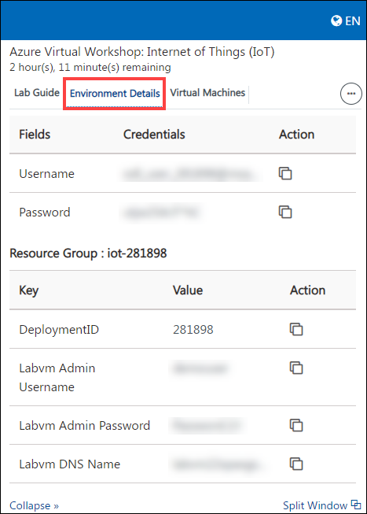
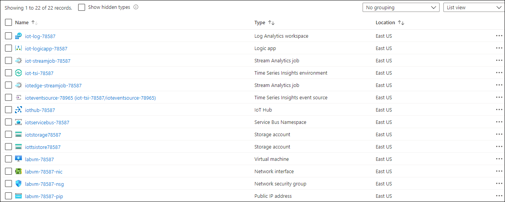
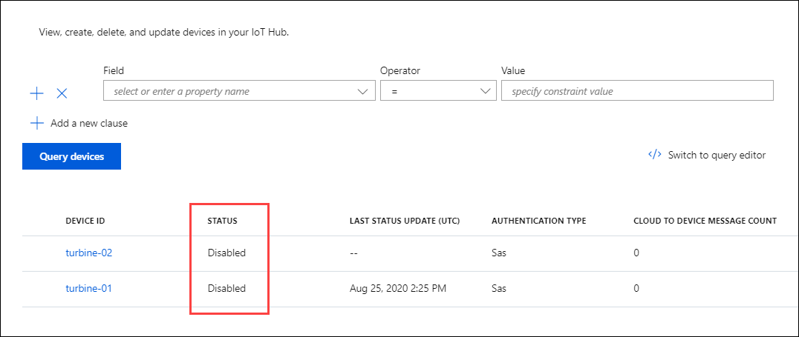
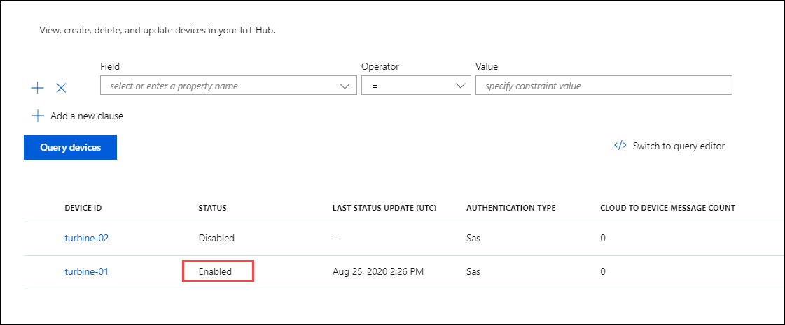
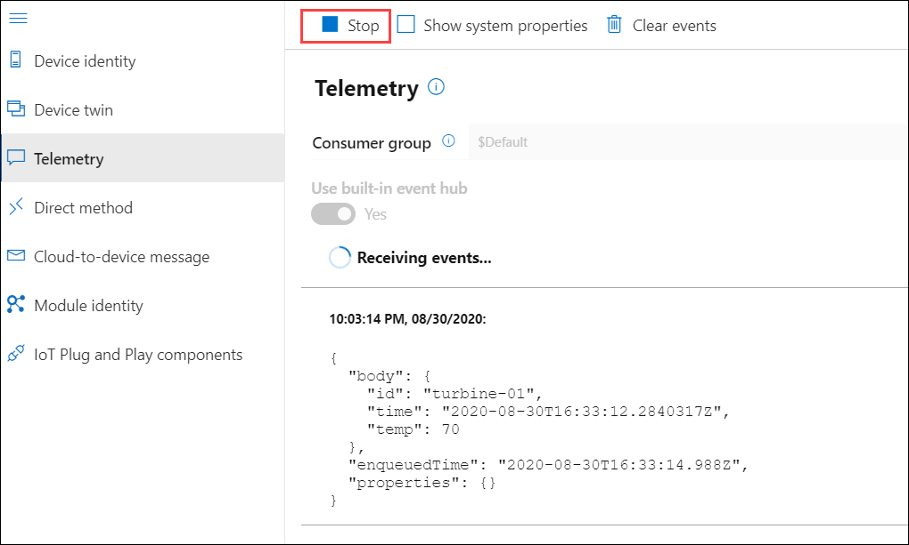

# Exercise 1: Getting Started with Azure IoT Services

## Scenario

Fabrikam, Inc.’s *Turbines (devices)* are deployed across the globe. You need to configure the Azure IoT Hub Solution to receive telemetry and manage all the devices centrally in a reliable and scalable fashion.

## Overview

In this exercise, you will connect devices deployed across the globe to Azure IoT Hub and start sending telemetry data from turbine devices to Azure IoT Hub.

You will be performing the following activities to achieve the goal.

* Login to Azure Portal and Verify pre-created Azure IoT Hub and other resources. 
* Register device (simulated) to Azure IoT Hub.
* Enable device (simulated).
* Send telemetry from devices to Azure IoT Hub
* Review telemetry data stream from Azure IoT Hub IoT Explorer

## Instructions

### Getting Started with Lab

1. Once the environment is provisioned, a virtual machine (JumpVM) on the left and lab guide on the right will get loaded in your browser. Use this virtual machine throughout the workshop to perform the lab.

1. To get the lab environment details, you can select the **Lab Environment** tab, you can locate the **Lab Environment** tab on the upper right corner. Additionally, the credentials will also be emailed to your email address provided during registration.

   

 > You will see Suffix/DeploymentID value on the **Lab Environment** tab, please use it wherever you see SUFFIX or DeploymentID in lab steps. This is a unique number associated with each lab deployment. 
 
#### Task 1: Log in to Azure Portal and verify the pre-deployed resources

1. In the JumpVM, double click on the Azure portal shortcut on the desktop.

     

1. On **Sign in to Microsoft Azure** blade, you will see a login screen, in that enter the following email/username and then click on **Next**. 
   * Email/Username: <inject key="AzureAdUserEmail"></inject>

1. Now enter the following password and click on **Sign in**.
   * Password: <inject key="AzureAdUserPassword"></inject>

1. If you see the pop-up **Stay Signed in?**, click Yes

1. If you see the pop-up **You have free Azure Advisor recommendations!**, close the window to continue the lab.

1. If a **Welcome to Microsoft Azure** popup window appears, click **Maybe Later** to skip the tour.
   
1. In the upper left corner of the portal window, to open the **Resource Groups** menu, click the toggle menu icon and then click on **Resource groups**.

   

   This blade displays all of the resource groups that you have access to the Azure subscription.

1. You will find a pre-created resource named **iot-<inject key="DeploymentID" enableCopy="false"/>**. This resource group contains all the resources required for the lab. Select the resource group and review the pre-created resources in the resource group. 

     

   > **Note:** **Deployment id** is the unique number per deployment. You can find your deployment id from the **Lab Environment** tab on the upper right corner.
    
#### Task 2: Connect Turbine device (simulated) to Azure IoT Hub

**IoT Hub** is an Azure service that enables you to ingest high volumes of telemetry from your IoT devices into the cloud for storage or processing. You can find more references about IoT Hub from here: ```https://docs.microsoft.com/en-us/azure/iot-hub/about-iot-hub```.

In this task, you will connect Fabrikam, Inc.’s Turbine Devices to Azure IoT Hub. Once connected, you will configure the turbine devices to send telemetry to IoT Hub. Here are the high-level steps you will be performing:

   * Register the Turbine Devices to IoT Hub
   * Enable the registered devices you want to be a part of the solution
   * Start sending data from the devices to IoT Hub.


1. From the **Environment Details** Tab on the right, copy the value of **IotHubConnectionString**. This connection string will be used in the next steps to establish a connection between the IoT hub and the Simulator App, and also to establish a connection with Azure IoT Explorer.

    > **Note**: You can also get the connection string by navigating to IoT Hub -> click Shared Access policies under settings -> Then click on iothubowner under Policy Tab and copy the Connection string - primary key value.

1. Minimize the azure portal and open the **IoT Simulator App** by clicking on the **IoT simulator** shortcut on the virtual machine desktop. 

1. Paste the **Connection string** value which you copied earlier in the textbox.

1. Click the **Connect** button on the right to establish a connection with IoT Hub.

1. Once the connection is successful, you will see a pop-up message **Connection Successful**, Click **OK** and you will be able to see the list of Turbine devices. Each represents a device for which you want to simulate device installation.

   
   
1. Click on **Register** next to the **turbine-01** and **turbine-02** on the IoT Simulator app dialog to register the device to the IoT Hub.

   

1. Minimize the **IoT Hub Simulator App** and navigate to the resource group, select the IoT Hub named **iothub-<inject key="DeploymentID" enableCopy="false"/>**.

1. Click **IoT devices** under the Explorers section and you can observe that the registered IoT devices are listed here.
 
   

1. Open the IoT Simulator App and click on the **Activate** button next to the registered device to simulate changing the device status from disabled to enabled in the IoT Hub Registry.

   

   > **Note: Repeat the above steps to register and activate all the devices**. 
                  
1. At this point, you have registered and activated devices. To view this list of devices, Switch over to the Azure Portal and select the IoT Hub **iot-hub-<inject key="DeploymentID" enableCopy="false"/>**.

  > **Note: You may have to refresh the browser to see the devices**. 

1. From the IoT Hub blade, select IoT Devices under Explorers on the left-hand menu.

1. You should see all the devices listed, with the ones that you activated having a status of enabled.

1. Navigate back to the IoT simulator application and Click on **Send Telemetry**. Within a few moments, the grid on the simulator application will list each telemetry message transmitted and the simulated temperature value.

   
   
   You've now configured the turbines to send temperature data to Azure IoT Hub. 
   
#### Task 3: Verify telemetry stream from Azure IoT Hub using IoT Explorer

The **Azure IoT Explorer** is a graphical tool for interacting with and testing your IoT Plug and Play Preview devices. You can use the tool to view the telemetry the devices are sending, work with device properties, and invoke commands. You can learn more about Azure IoT Explorer by following the link: ```https://docs.microsoft.com/en-us/azure/iot-pnp/howto-use-iot-explorer```

In this task, you will use the **Azure IoT Explorer** to review the telemetry data sent by the simulated turbine device to Azure IoT Hub.

1. Launch the Azure IoT Explorer application by clicking on **Azure IoT Explorer** shortcut on the virtual machine desktop.

1. Click on **+ Add connection** on the IoT Hub pane.

   

1. Enter the **Connection string** value of IoT Hub. You used this value to connect turbine devices in the last task.

   > **Note**: You can find the **Connection string** value at **IoTHubConnectionString** under **Environment Details** tab at the right of the workspace.
   
1. Click **Save**

   

1. Under the **Devices** pane you can see the **IoT devices** you have connected and registered in the previous task.

1. Click on **turbine-01** from the list of Devices.

   

1. Select **Telemetry** from the left-hand side and click on the **Start** option.

   

   This enables you to monitor the data being sent to the IoT hub. You are also verifying that the device is able to connect and communicate with your IoT hub.

1. Within 2-3 minutes you will receive telemetry data and you should be seeing messages displayed similar to the following: Take a look at sample data to review the temperature values. 
    
   
  
1. Once you have verified that the IoT hub is receiving the telemetry from the Fabricam Inc's Turbine devices, press **Stop** and then close **Azure IoT Explorer** application.

   
   
In this exercise, you connected Fabrikam, Inc.’s turbine devices to Azure IoT Hub. You also enabled the devices to send telemetry to IoT Hub and verified the telemetry stream.
