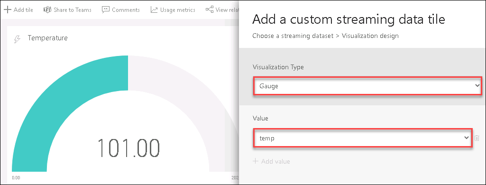
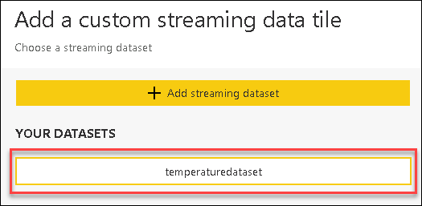
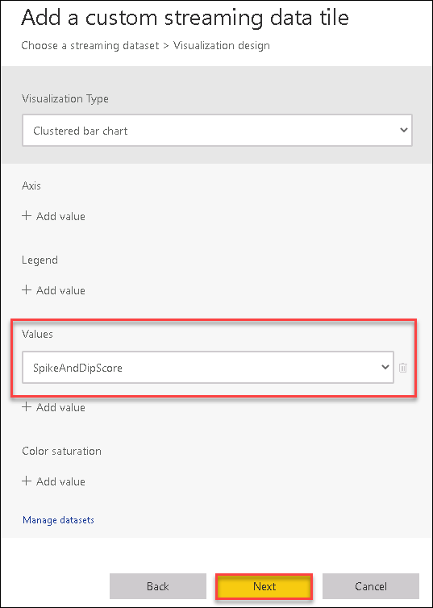
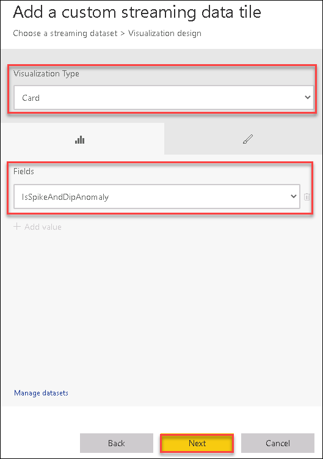
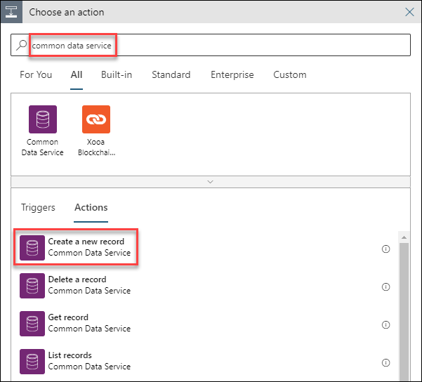
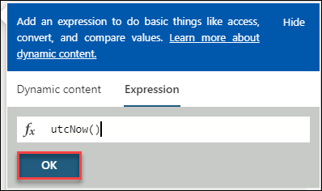
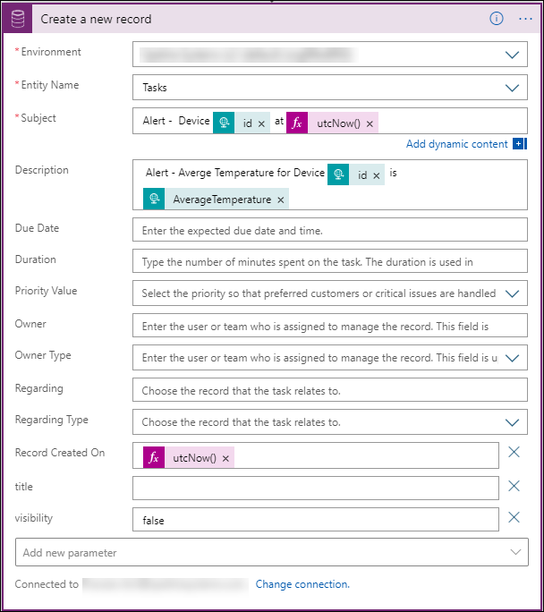

# Exercise 3: Machine Learning in IoT and Real-Time Monitoring using Power BI

## Scenario

Insights generated so far require manual involvement to detect anomalies. We need to make use of automated techniques to detect anomalies.
Up-on anomaly detection, Your team decides that further improvements to the monitoring system will require near-real-time data exploration and alerting the issue needs to be escalated as soon as possible.

## Overview

In this exercise, you will use automated in-built Machine Learning models to analyze the data from the Turbine devices and detect anomalies instead of manual involvement to detect anomalies, and also you will use the output from the query in the previous exercise to visualize the data in a Power BI dashboard.

This exercise includes the following tasks:

* Triggering anomalies using IoT Simulator App
* Detect Anomalies using built-in Machine Learning Model
* Create a Power BI Dashboard and Visualize Anomaly Data
* Get alert when an anomaly is detected[Optional]

### Task 1: Triggering anomalies using IoT Simulator App

1. On the Desktop of the provide machine on the left, open the IoT simulator app.

1. From the IoT simulator app dialog, Click on the **Anomaly** button which is next to stop telemetry that sends anomalies to the IoT hub.

    >**Note**: If the devices are not sending telemetry, make sure to start IoT Simulator App and simulate the devices by sending telemetry.
    
1. On the grid, a list of telemetry messages that are transmitted is displayed. Observe the simulated temperature value. You will see a sudden spike in the temperate values.

### Task 2: Detect Anomalies using built-in Machine Learning Model

In this task you will be using the following ML Model to detect the anomalies:

**Built-in Machine Learning Model** - The AnomalyDetection_SpikeAndDip function uses a sliding window to analyze data for anomalies. The sliding window could be, for example, the most recent two minutes of telemetry data. The window advances in near real-time with the flow of telemetry. If the size of the sliding window is increased to include more data, the accuracy of anomaly detection will increase as well (however, the latency also increases, so a balance must be found).

1. On the resource group tile, click **iot-{deployment-id}** and select the stream analytics job named **iot-streamjob-{deployment-id}**.

   >**Note**: Please ensure that the stream analytics job is **stopped** before editing the query in the next step.

1. On the left-side menu under **Job topology**, click on **Query**.

1. Copy the following SQL query, and then replace it with the existing query.

    ```sql
     WITH AnomalyDetectionStep AS
     (
       SELECT
           EventProcessedUtcTime AS time,
           CAST(temp AS float) AS temp,
           AnomalyDetection_SpikeAndDip(CAST(temp AS float), 90, 120, 'spikesanddips')
               OVER(LIMIT DURATION(second, 120)) AS SpikeAndDipScores
       FROM iothubinput
    )
       SELECT
           time,
           temp,
           CAST(GetRecordPropertyValue(SpikeAndDipScores, 'Score') AS float) AS
           SpikeAndDipScore,
           CAST(GetRecordPropertyValue(SpikeAndDipScores, 'IsAnomaly') AS bigint) AS
           IsSpikeAndDipAnomaly
      INTO powerbioutput
      FROM AnomalyDetectionStep
      
      SELECT * INTO bloboutput FROM iothubinput;
      
      SELECT AVG(temp) AS AverageTemperature, id INTO servicebusoutput FROM iothubinput GROUP BY TumblingWindow(minute, 1), id HAVING AVG(temp) > 72 ;
    ```

    > **Note**:  This first section of this query takes the temperature data, and examines the previous 120 seconds worth. The `AnomalyDetection_SpikeAndDip` function will return a `Score` parameter, and an `IsAnomaly` parameter. The score is how certain the ML model is that the given value is an anomaly, specified as a percentage. If the score exceeds 90%, the `IsAnomaly` parameter has a value of 1, otherwise `IsAnomaly` has a value of 0. Notice the 120 and 90 parameters in the first section of the query. The second section of the query sends the time, temperature, and anomaly parameters to `powerbioutput`.
 
    > **Note**: The third section of the query, **SELECT AVG(temp) AS AverageTemperature, id INTO servicebusoutput FROM iothubinput GROUP BY TumblingWindow(minute, 1), id HAVING AVG(temp) > 72 ;**, looks at the events coming into the "iothubinput" Input and groups by a Tumbling Window of one minute. And then sends the average of temperature greater than 72 and id to the "servicebusoutput" Output, For more information about the `TumblingWindow` functions, reference this link: https://docs.microsoft.com/en-us/stream-analytics-query/tumbling-window-azure-stream-analytics

1. Verify that the query editor now lists 1 Input and 3 Outputs:

    * `Inputs`
      * `iothubinput`
    * `Outputs`
      * `bloboutput`
      * `powerbioutput`     
      * `servicebusoutput`

    If you see more than 1 of each then you likely have a typo in your query or in the name you used for the input or output - correct the issue before moving on.

1. To save the query, click **Save query**.

1. On the left-side menu, click **Overview**.

1. Near the top of the blade, click **Start**.

   > **Note**: If you see the Job fails, then perform the following steps:
     *  Select **Outputs** under Job Topology and select **powerbioutput**
     * Then, in the blade that comes up, click on Renew authorization and when prompted for Azure Credentials, provide the Azure Username and Password from the environment details tab and then click on Save.

1. On the **Start job** pane, under **Job output start time**, ensure **Now** is selected, and then click **Start**.

For a human operator to easily interpret the output from this query, you need to visualize the data in a friendly way. One way of doing this visualization is to create a Power BI dashboard. You will be doing that in the next exercise.

### Task 3: Create a Power BI Dashboard and Visualize Anomaly Data

In the previous task, you had configured stream analytics job to process the telemetry via the ML model and output the results to Power BI. Within Power BI, you need to create a dashboard with some tiles to visualize the results and provide decision support for the operator.

To analyze the data in real-time, we will use some built-in functionality of Power BI along with the ability of Azure Stream Analytics to send data in a real-time format that Power BI can ingest.

We will use the dashboard feature of Power BI to create some tiles. One tile contains the average temperature measurement. Another tile is a gauge, showing from 0.0 to 1.0 the confidence level that the value is an anomaly. A third tile indicates if the 90% confidence level is reached. Finally, the fourth tile shows the number of anomalies detected over the past hour. By including time as the x-axis, this tile makes it clear if a clutch of anomalies were detected in short succession as they will be clustered together horizontally.

The fourth tile allows you to compare the anomalies.

1. In your browser, navigate again to [https://app.powerbi.com/](https://app.powerbi.com/).

1. Once Power BI has opened, on the left-side navigation menu, expand **Workspaces**, and then select the **My workspace**.

    > **Note**:  At the time of writing, Power BI has a *New Look* in preview. The steps in this task have been written assuming the *New Look* is **Off**. To turn off the *New Look*, on the toolbar at the top of the screen, ensure that the toggle reads **New look off**. 

1. On the **Datasets** tab, verify that **temperaturedataset** is displayed.
   
1. At the top right of the page, click **+ Create**, and then click **Dashboard**.

1. In the **Create dashboard** popup, under **Dashboard name**, type **Temperature Dash** and then click **Create**.

    The new dashboard will be displayed as an essentially blank page.

1. To add a Temperature gauge, at the top of the blank dashboard, click **+ Add tile**.

1. In the **Add tile** pane, under **REAL-TIME DATA**, click **Custom Streaming Data**, and then click **Next**.

1. On the **Add a custom streaming data tile** pane, under **YOUR DATASETS**, click **temperaturedataset**, and then click **Next**.

    The pane will refresh to allow you to choose a visualization type and fields.

1. Under **Visualization Type**, open the dropdown, and then click **Gauge**.

1. Under **Values**, click **+ Add value**, open the dropdown, and then click **temp**.

    Notice that the gauge appears immediately on the dashboard with a value that begins to update!

    

1. To display the Tile details pane, click **Next**.

1. In the **Tile details** pane, under **Title**, enter **Temperature**.

1. Leave the remaining fields with default values and close the pane and then click on **Apply**.

    If you see a notification about creating a phone view, you can ignore it and it will disappear shortly (or dismiss it yourself).

1. To reduce the size of the tile, hover your mouse over the bottom-right corner of the tile, and then click-and-drag the resize mouse pointer.

    Make the tile as small as you can. It will snap to various preset sizes.

1. To add the SpikeAndDipScore Clustered Bar Chart, at the top of the dashboard, click **+ Add tile**.

    

1. In the **Add tile** pane, under **REAL-TIME DATA**, click **Custom Streaming Data**, and then click **Next**.

1. On the **Add a custom streaming data tile** pane, under **YOUR DATASETS**, click **temperaturedataset**, and then click **Next**.

   

1. Under **Visualization Type**, open the dropdown, and then click **Clustered bar chart**.

    Notice that changing the visualization type changes the fields below.

1. Under **Values**, click **+ Add value**, open the dropdown, and then click on **SpikeAndDipScore**.

   

1. To display the Tile details pane, click on **Next**.

1. In the **Tile details** pane, under **Title**, enter **SpikeAndDipScore**

1. To close the Tile details pane, click on **Apply**.

    If you see a notification about creating a phone view, you can ignore it and it will disappear shortly (or dismiss it yourself).

1. Again, reduce the size of the tile, making it as small as you can.

1. At the top of the dashboard, to add an IsSpikeAndDipAnomaly Card visualization, click **+ Add tile**.

1. In the **Add tile** pane, under **REAL-TIME DATA**, click **Custom Streaming Data**, and then click **Next**.

1. On the **Add a custom streaming data tile** pane, under **YOUR DATASETS**, click **temperaturedataset**, and then click **Next**.

1. Under **Visualization Type**, open the dropdown, and then click **Card**.

1. Under **Fields**, click **+ Add value**, open the dropdown, and then click **IsSpikeAndDipAnomaly**.

1. To display the Tile details pane, click **Next**.

   

1. In the **Tile details** pane, under **Title**, enter **Is Anomaly?**

1. To close the Tile details pane, click **Apply**.

    If you see a notification about creating a phone view, you can ignore it and it will disappear shortly (or dismiss it yourself).

1. Again, reduce the size of the tile, making it as small as you can.

1. Using drag-and-drop, arrange the tiles vertically on the left of the dashboard in the following order:

    * SpikeAndDipScore
    * Is Anomaly?
    * Temperature

1. At the top of the dashboard, click **+ Add tile**.

1. In the **Add tile** pane, under **REAL-TIME DATA**, click **Custom Streaming Data**, and then click **Next**.

1. On the **Add a custom streaming data tile** pane, under **YOUR DATASETS**, click **temperaturedataset**, and then click **Next**.

    The pane will refresh to allow you to choose a visualization type and fields.

1. Under **Visualization Type**, open the dropdown, and then click **Clustered bar chart**.

    Notice that changing the visualization type changes the fields below.

1. Under **Axis**, click **+ Add value**, and then select **time** from the dropdown.

1. Under **Values**, click **+ Add value**, and then select **IsSpikeAndDipAnomaly** from the dropdown.

1. Under **Time window to display**, to the right of **Last**, open the dropdown, and then click **60**

    Leave the units set to **Minutes**.

1. To display the Tile details pane, click **Next**.

   

1. In the **Tile details** pane, under **Title**, enter **Anomalies over the hour**.

1. To close the Tile details pane, click **Apply**.

    If you see a notification about creating a phone view, you can ignore it and it will disappear shortly (or dismiss it yourself).

1. This time, stretch the tile so its height matches the 3 tiles to the left and its width fits the remaining space of the dashboard.

    There is latency with so many routes and connections, but you should start seeing the turbine temperature data in the visualizations.

    > **Note**:  If no data appears, check you are running the IoT simulator app and the analytics job is running. Also, you can start sending anomalies for few seconds and then stop it to see the fluctuations in Power BI dashboard that you have configured.

    Let the job run for a while, several minutes at least before the ML model will kick in. Compare the console output of the device app, with the Power BI dashboard. Are you able to correlate the forced and increasing vibrations to a run of anomaly detections?

1. Now you should be seeing an active Power BI dashboard like this.

   

### Task 4: Get alert when an anomaly is detected [Read-Only]

**** 
**This will be a read-only task, as the provided lab environment doesn't have a D365 License associated to complete this task**.
****

In this task, you will configure **Logic App** to be triggered by a **Service Bus queue** and add a record in Dynamics 365. The data will be sent to the Service Bus queue from Stream Analytics if the average temperature of the devices exceeds a certain value.

1. Navigate to your Resource group **iot-{deploymentid}** and select the logic app **iot-logicapp-{deployment-id}**.

1. Select **Blank Logic App +** tile from the Logic app designer pane.

1. In the search box, enter **"azure service bus"** as your filter. From the triggers list, select the trigger **When a message is received in a queue (auto-complete) ** trigger.

   
   
1. Follow these steps when the Logic App Designer prompts you for connection information.

   * Provide a name for your connection, for example like **iotservicebusconnection**.
   * Select your **Service Bus namespace**.
   * Select your Service Bus policy and select **Create**.

1. Select the messaging entity **iotqueue**.
    
1. Provide the necessary information for your selected trigger. To add other available properties to the action, open the Add new parameter list, and select the properties that you want. For example, select the polling interval and frequency for checking the queue.

1. Under the step where you want to add an action, select **+ New step**.

1. Type **Data operations** and select it from the menu. Then select the **Parse JSON** action.

1. Select the content field and feed in the following expression:
   **decodeBase64(Body()?[‘Content’])**
   
1. Click **Use sample payload to generate schema** and then paste in the following JSON sample payload.    

   **{"AverageTemperature":90,"id":"turbine-01"}**
   
1. Click **Save** on the command bar.

  > Note: In the next step, you will be adding Dynamics 365 connector for Logic App which is the Common Data Services

1. Click **+ New Step** on your process, then type in **Common Data Services**, Select **Common Data Services**, and then select **Create a new record** action.

   

   **Note**: You will not be able to perform the remaining steps using the CloudLabs provided credentials, but can go through the remaining steps to understand how to configure alerts.

1. Click on **Sign in** to create a connection to Common Data Service.

   

1. Select your **Environment** and the Entity "**Tasks**" from the dropdown.

   
   
1. Now Click on the **Add new parameter** at the bottom of the section and select "Record Created On".

1. In the **Subject** field, provide **Alert - Device {Dynamic Content id } at { Expression utcNow() }**. For dynamic content and expression, you need to select the value for the  identifier from the dynamic content available under parse JSON and utcNow() function in expressions

   

1. In the **Description** field, enter the following message content:

    ```text
     Alert - Average Temperature for Device  @{Dynamic Content['id']} is  @{Dynamic Content['AverageTemperature']}
    ```

1. Next, add Dynamics expression utcNow() against "Records created on" field.

   
    
1. Once the logic app is configured properly and when a trigger happens, you will see an entry in the Dynamics 365 Tasks.

    > **Note**:  Explore through the Logic App Designer and continue to the next exercise without **Saving** the changes.
