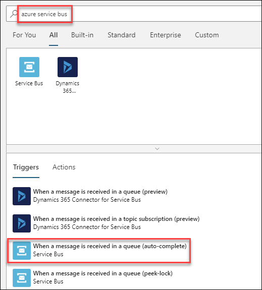
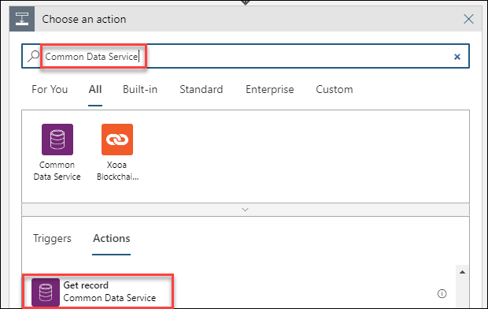
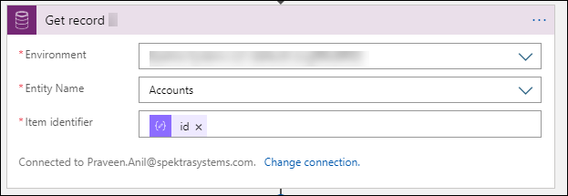

# Exercise 4: Real Time Monitoring of Data

## Scenario

Upon anomaly detection, Your team decides that further improvements to the monitoring system will require near real-time data exploration and alerting

## Overview

In this exercise, you will use the output from the query in previous exercise to visualize the data in a Power BI dashboard.

This exercise includes the following tasks:

* Create a Power BI Dashboard and Visualize Anomaly Data
* Get alert when an anomaly is detected[Optional]


### Task 1: Create a Power BI Dashboard and Visualize Anomaly Data

In the previous task, you had configured stream analytics job to process the telemetry via the ML model and output the results to Power BI. Within Power BI, you need to create a dashboard with a number of tiles to visualize the results and provide decision support for the operator.

1. In your browser, navigate again to [https://app.powerbi.com/](https://app.powerbi.com/).

1. Once Power BI has opened, on the left-side navigation menu, expand **Workspaces**, and then select the **My workspace**.

    > **Note**:  At the time of writing, Power BI has a *New Look* in preview. The steps in this task have been written assuming the *New Look* is **Off**. To turn off the *New Look*, on the toolbar at the top of the screen, ensure that the toggle reads **New look off**. 

1. On the **Datasets** tab, verify that **temperaturedataset** is displayed.

    If not, you might have to wait for few mninutes for this list to populate.

1. At the top right of the page, click **+ Create**, and then click **Dashboard**.

1. In the **Create dashboard** popup, under **Dashboard name**, type **Temperature Dashboard** and then click **Create**.

    The will open up dashboard designed.

1. To add a vibration gauge, at the top of the empty dashboard, click **+ Add tile**.

1. In the **Add tile** pane, under **REAL-TIME DATA**, click **Custom Streaming Data**, and then click **Next**.

1. On the **Add a custom streaming data tile** pane, under **YOUR DATASETS**, click **temperaturedataset**, and then click **Next**.

    The pane will refresh to allow you to choose a visualization type and fields.

1. Under **Visualization Type**, open the dropdown, and then click **Gauge**.

    Notice that changing the visualization type changes the fields below.

1. Under **Values**, click **+ Add value**, open the dropdown, and then click **temp**.

    Notice that the gauge appears immediately on the dashboard with a value that begins to update!

1. To display the Tile details pane, click **Next**.

1. In the **Tile details** pane, under **Title**, enter **Temperature**.

1. To leave the remaining fields at default values and close the pane, click **Apply**.

    If you see a notification about creating a phone view, you can ignore it and it will disappear shortly (or dismiss it yourself).

1. To reduce the size of the tile, hover your mouse over the bottom-right corner of the tile, and then click-and-drag the resize mouse pointer.

    Make the tile as small as you can. It will snap to various preset sizes.

1. To add the SpikeAndDipScore Clustered Bar Chart, at the top of the dashboard, click **+ Add tile**.

1. In the **Add tile** pane, under **REAL-TIME DATA**, click **Custom Streaming Data**, and then click **Next**.

1. On the **Add a custom streaming data tile** pane, under **YOUR DATASETS**, select **temperaturedataset**, and then click **Next**.

1. Under **Visualization Type**, open the dropdown, and then click **Clustered bar chart**.

    Notice that changing the visualization type changes the fields below.

1. Under **Values**, click **+ Add value**, open the dropdown, and then click on **SpikeAndDipScore**.

1. To display the Tile details pane, click on **Next**.

1. In the **Tile details** pane, under **Title**, enter **SpikeAndDipScore**

1. To close Tile details pane, click on **Apply**.

    If you see a notification about creating a phone view, you can ignore it and it will disappear shortly (or dismiss it yourself).

1. Again, reduce the size of the tile, making it as small as you can.

1. At the top of the dashboard, to add a IsSpikeAndDipAnomaly Card visualization, click **+ Add tile**.

1. In the **Add tile** pane, under **REAL-TIME DATA**, click **Custom Streaming Data**, and then click **Next**.

1. On the **Add a custom streaming data tile** pane, under **YOUR DATASETS**, click **temperaturedataset**, and then click **Next**.

1. Under **Visualization Type**, open the dropdown, and then click **Card**.

1. Under **Fields**, click **+ Add value**, open the dropdown, and then click **IsSpikeAndDipAnomaly**.

1. To display the Tile details pane, click **Next**.

1. In the **Tile details** pane, under **Title**, enter **Is Anomaly?**

1. To close the Tile details pane, click **Apply**.

    If you see a notification about creating a phone view, you can ignore it and it will disappear shortly (or dismiss it yourself).

1. Again, reduce the size of the tile, making it as small as you can.

1. Using drag-and-drop, arrange the tiles vertically on the left of the dashboard in the following order:

    * SpikeAndDipScore
    * Is Anomaly?
    * Temperature

Now Let's create a fourth tile for `Anomalies Over the Hour` line chart.  This one includes a bit more configuration than the previous ones.

1. At the top of the dashboard, click **+ Add tile**.

1. In the **Add tile** pane, under **REAL-TIME DATA**, click **Custom Streaming Data**, and then click **Next**.

1. On the **Add a custom streaming data tile** pane, under **YOUR DATASETS**, click **temperaturedataset**, and then click **Next**.

    The pane will refresh to allow you to choose a visualization type and fields.

1. Under **Visualization Type**, open the dropdown, and then click **Clustered bar chart**.

    Notice that changing the visualization type changes the fields below.

1. Under **Axis**, click **+ Add value**, and then select **time** from the dropdown.

1. Under **Values**, click **+ Add value**, and then select **IsSpikeAndDipAnomaly** from the dropdown.

    Notice that the chart appears immediately on the dashboard with a value that begins to update!

1. Under **Time window to display**, to the right of **Last**, open the dropdown, and then click **60**

    Leave the units set to **Minutes**.

1. To display the Tile details pane, click **Next**.

1. In the **Tile details** pane, under **Title**, enter **Anomalies over the hour**.

1. To close the Tile details pane, click **Apply**.

    If you see a notification about creating a phone view, you can ignore it and it will disappear shortly (or dismiss it yourself).

1. This time, stretch the tile so its height matches the 3 tiles to the left and its width fits the remaining space of the dashboard.

    There is a latency with so many routes and connections, but you should start seeing the vibration data in the visualizations

    > **Note**:  If no data appears, check you are running the device app and the analytics job is running.

    Let the job run for a while, several minutes at least before the ML model will kick in. Compare the console output of the device app, with the Power BI dashboard. Are you able to correlate the forced and increasing vibrations to a run of anomaly detections?

If you're seeing an active Power BI dashboard, you've just completed this lab. Great work.

### Task 2: Configure alert notifications when an anomaly is detected [Optional]

When you add a trigger or action that connects to a service or system for the first time, the **Logic App Designer** prompts you to create a connection by providing the necessary information, which varies based on the connection.

1. Navigate to your Resource group **iot-{deploymentid}** and select the logic app **iot-logicapp-{deployment-id}**.

1. Select **Blank Logic App +** tile from Logic app designer pane .

1. In the search box, enter **"azure service bus"** as your filter. From the triggers list, select the trigger that you want.

1. For example, to trigger your *logic app* when a new item gets sent to a Service Bus queue, select the **When a message is received in a queue (auto-complete) trigger**.

   

   When one or more messages arrive in a queue (auto-complete) trigger, can return one or more messages. When these triggers fire, they return between one and the number of messages that's specified by the trigger's Maximum message count property.
   
1. If your trigger is connecting to your Service Bus namespace for the first time, follow these steps when the Logic App Designer prompts you for connection information.

   * Provide a name for your connection, for example like **iotservicebusconnection**.
   * Select your **Service Bus namespace**.
   * Select your Service Bus policy, and select **Create**.

1. Select the messaging entity you want, such as a **queue** or topic
   
    
    
1. Provide the necessary information for your selected trigger. To add other available properties to the action, open the Add new parameter list, and select the properties that you want. For example, select the polling interval and frequency for checking the queue.

1. Under the step where you want to add an action, select **+ New step**.

1. Type **Data operations** and select it from the menu. Then select the **Parse JSON** action.

1. Select the content field and feed in the following expression:
   **decodeBase64(triggerBody()?[‘ContentData’])**
   
1. Click **Use sample payload to generate schema** and then paste in the following JSON sample payload.    

   **{"Temperature":90,"id":"turbine-01"}**
   
1. Click **Save** on the command bar.

1. Click **+ New Step** on your process, then type in **Common Data Services**, Select **Common Data Services** and then select **Get record** action.

   

   **Note**: You will not be able to perform the remaining steps using the CloudLabs provided credentials, but can take a look at the remaining steps to understand how to configure alerts.

1. Click on **Sign in** to create a connection to Common Data Service.

   

1. Select your **environment name** and the **entity name** from the dropdown and select the value for Item identifier from the dynamic content available under parse           json.

   
   
1. Click **+ New Step** on your process, then type in **Office 365 Outlook**, Select **Send an email(V2)**.

1. On the **Outlook.com** connector, click **Sign In**, and then follow the prompts to authenticate with an existing Outlook.com account.

1. On the **Send an email (V2)** action, in the **To** field select **Email** from the dynamic content available under **Get record**.

    For the purposes of this lab, you will provide an email address where you can receive the email notification. You can enter the Outlook.com account used for this connector, or another email account that is easy for you to access.

    The Outlook.com account that was authenticated in the step above will be used to send the emails.

1. In the **Subject** field, enter **IoT Hub alert:**

1. In the **Body** field, enter the following message content:

    ```text
    This is an automated email to inform you that:

    Device ID: @{body('Parse_JSON')?['id']}had a high temperature of @{body('Parse_JSON')?['Temperature']}
    ```

   
    
1. Once the logic app is configured properly, you will recieve an email.

    > **Note**:  Explore through the Logic App Designer and continue to next exercise without **Saving** the changes.
